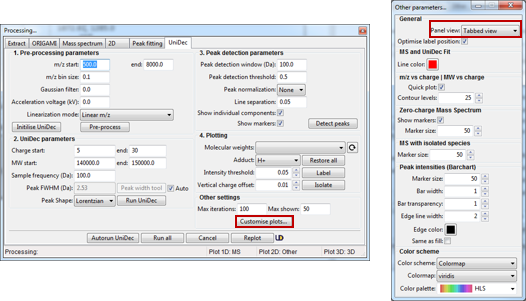

# Changing UniDec window
Since version 1.2.0.3, ORIGAMI-ANALYSE shows UniDec plots in a seperate tab rather than in the continous view. It is quite straightforward to switch back to the **continous view**.

1. Open the Processing panel: UniDec (**SHIFT+6** on your keyboard or menu -> Process -> UniDec).
2. Click on the Customise plots... button
3. Change the setting: **Panel view** to what you would prefer.

**Note:** This will only take effect when you restart ORIGAMI-ANALYSE.

