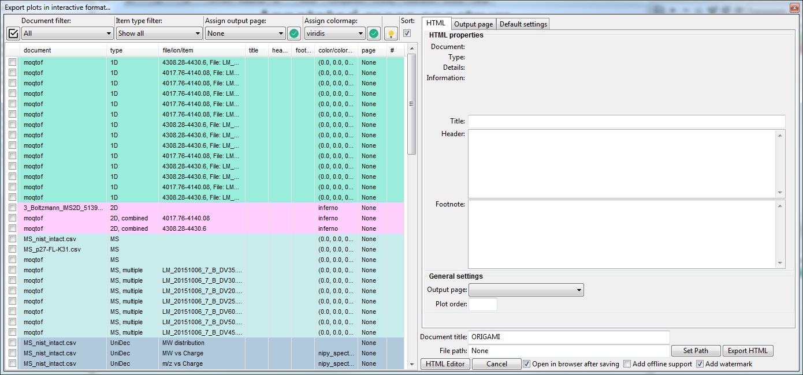
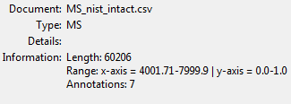

# Exporting interactive figures

ORIGAMI enables creation of HTML/JavaScript webpages which embed interactive versions of figures visualised in ORIGAMI. Practically all figures that you can generate in the desktop application can be also exported to a HTML document that can be shared with your supervisor, journal reviewers or collaborators for their in-depth interrogation.

While this might seem like a bit of a gimmick, it makes sense to share the results with the scientific community in a manner more explorative than a simple static image. See here for some helpful encouragement ([_Perkel_](https://www.nature.com/articles/d41586-018-01322-9) and [_Weissgerber_](https://journals.plos.org/plosbiology/article/file?id=10.1371/journal.pbio.1002484&type=printable)).

## Example

In this example we will use a file provided with the ORIGAMI distribution. You can download [MS file](../example-files/MS_nist_intact.csv) or you can find it in your ORIGAMI directory (**example_data/text**).

## Interactive output panel

You can use any example file here as once you open the output window, all available plots will be shown in a list. In this case, the list contains all available items from a number of previous examples (e.g. annotating mass spectra, combining drift voltages, etc).

If you click on any item in the list, its previously provided settings such as _title, header, footnote information_ or _plot parameters_ will be automatically rendered. Focusing on a mass spectrum first, you can see some useful information about the size of _number of annotations, min/max ranges_ and _its size_.

Check that item and click on the **Export HTML** button. You will be asked to provide a _path_ where you would like to save the document. Make sure to check the **Open in browser after saving** checkbox.

You can checkout a mass spectrum example [here](../../interactive-examples/mass-spectrum.md) and heatmap example [here](../../interactive-examples/heatmap.md).
