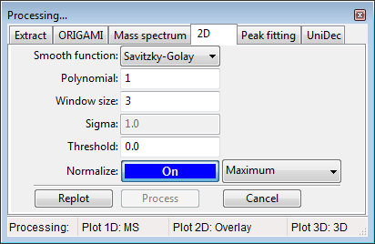
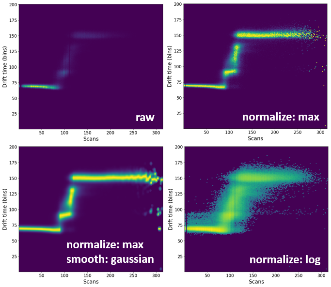

# Processing heatmaps

All two-dimensional heatmaps can be processed to produce a more visually attractive figure.

## Video tutorial on how to process heatmaps

<iframe width="560" height="315" src="https://www.youtube.com/embed/lHCT3gIsoLY" frameborder="0" allow="accelerometer; autoplay; encrypted-media; gyroscope; picture-in-picture" allowfullscreen></iframe>

## Loading data

Please have a look at [Loading Text files](../data-handling/text-files.md).
In short, you either drag-and-drop the text file in the main window of ORIGAMI-ANALYSE or go to **File -> Open IM-MS Text file**.

## Example

In this example we will use a file provided with the ORIGAMI distribution. You can download [heatmap files](../example-files/heatmaps.zip) or you can find them in your ORIGAMI directory (**example_data/text**).

## Opening processing panel

The easiest way to process a heatmap is to find it in the Document Tree, right-click on it and select the **Process...** option. This will open a new window where you can select desired parameters and also execute the action. If you simply open the Processing window, it is not guaranteed ORIGAMI will know which heatmap you want to process, and will use the currently plotted heatmap as the data source. Of course, this is only a concern if you have more than one heatmap in the document.

## Processing

Heatmaps can be processed in a number of ways, however the most common is to remove noise (using the **threshold** value) and normalize it (using the **On/Off** toggle).

Setup your desired parameters and you can either **replot** the heatmap (data **will not** be added to the document) or **process** (data **will** be added to the document).

