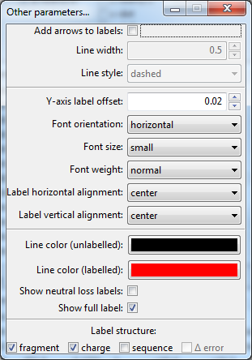
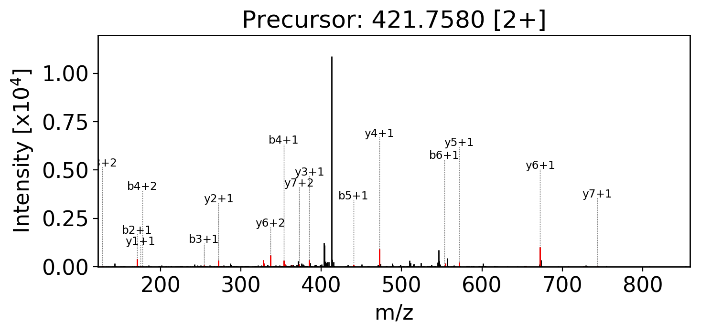

# What changed in ORIGAMIANALYSE

## Documentation

 Added online [documentation](https://lukasz-migas.github.io/ORIGAMI/)

 Added several new videos to the [YouTube playlist](https://www.youtube.com/playlist?list=PLrPB7zfH4WXMYa5CN9qDtl-G-Ax_L6AK8)

## Document Tree

 Fixed typo: spectrun -> spectrum (grr)

 When loading mzml/mgf files, the individual scans will no longer be shown in the document tree as it caused some major issues. If you would like to see the individual spectra, please double-click on the header 'Tandem Mass Spectra'

 Fixed a problem when trying to plot waterfall plot from the Document Tree menu

 When loading any data into the INTERACTIVE document, you will be asked whether data should be duplicated, merged or duplicated

 When plotting a waterfall plot, data will be checked to ensure its not too big (e.g. not too many rows). If the value is above the threshold (set to 500), you will be asked if you would like to continue

## Main window

 Added new menu: **Plugins**. This menu will hold all future mini-applications

 Umder the menu **Plot settings** I've added a couple new options that allow modification of plot extra plot parameters.

 The help pages **(Help -> Help pages -> ...)** have now been replaced with links to the new documentation (opens in the browser). Where no documentation exists yet, old pages will be shown. Also available [online](https://origami.lukasz-migas.com)

## Annotations

 you can now also easily 'duplicate/multiply' annotations. **Action -> Multiply annotations...** this will result in a copy of the selected annotation(s) with slight difference in the min-value (so they can be distinguished from its parent)

 Text annotations can now be added to other plots (scatter, v-bar, h-bar, waterfall, multi-line/overlay). To added annotations, find it in the **Document Tree**, right-click on it and you should be presented with option **Show annotations panel...**. Then you can simply follow the standard annotations protocol. See [here](https://origami.lukasz-migas.com/user-guide/processing/mass-spectra-annotation.html) for more information

 Annotations parameters can now be easily modified as they can be **dragged** on the plot. If an annotation is shown on your plot, you can simply drag it around in the plot area and once you let-go, new settings (e.g. position) will be updated in the ORIGAMI document.

 font size, weight and rotation will now be aplied when adding labels

 auto-label generator will now also create labels based purely on the charge state

 annotation parameters (e.g. size, weight, rotation) will be respected when replotting from the Document Tree

## Interactive panel

 Made big progres in terms of copying/applying styles for plot elements. When you
double-click on any element in the file list a new window will appear where you can individually adjust plot parameters. When you finished, you can right-click on that same (or any other) item in the list and select 'Copy style..'. You can then select any other item in the list, right-click on it and select 'Apply style..'.

 certain plot types (v-bar, h-bar, scatter, waterfall, multi-line/overlay) will now support addition of annotations (and their widgets). Annotations can correspond to anything you wish to say about specific region of a dataset.

 Scatter plots that are created from datasets loaded through text files with added metadata can be enhanced with weblinks/URLs. See the [example](https://origami.lukasz-migas.com/interactive-examples/ccs-compendium.html) for more information.

 fixed sorting in the list (especilaly when using the 'Show selected' option) Lists are sorted using 'natural sorting' from now on, meaning they should be more logically sorted.

 fixed the show/hide table elements when you right-click on the table headers

 Colorbars:

* added loads of new settings users can control
* better behaviour when adding colorbars to plots

 removed tools/toolset from ORIGAMI - the new system of copy/apply style should work much better

 I've realised that using 'coffeescript' for widget exportation was a big mistake as it takes ~10x+ longer to compile that script than pure JavaScript. Adding widgets will be a lot faster from now on (a couple haven't been ported to JS yet).

## Plots

 Improved color handling in violin and waterfall plots. The line color (edge) and shade/fill-under can be independently controlled now.

## UVPD processing :star:

 Added new plug that allows analysis and processing of UVPD datasets that were acquired with laser being constantly switched on/off. This is a user-specific plugin that will most likely have no use for anyone else apart from some Barran group members. To activate, click on the **Menu -> Plugins -> UVPD processing window...**.

## Tandem MS panel

 You can now load .mzML files (haven't figured out how to add .mzIdentML files to them yet...)

 MS/MS files can now be exported in an interactive format (.html document). This feature is still in development and I imagine will not be stable until v1.2.2 at the earliest. At the moment, individual scans of MS/MS file (.mgf only) can be annotated (e.g. fragments can be generated) and added to the file. Scans that have been user-annotated can be subsequently exported. This will be properly showcased in a tutorial.

 Added two new options in the **Action menu** which permit improved population of the table by either excluding scans with PTMs and excluding scans without identification. Clicking on either of these will automatically trigger re-population of the table based on the selected options.

 You can see what PTMs have been included in the scan by clicking on the **Modifications list**

 Scans that have multiple identification information will be separated into separae instances in the table (e.g. look at the column ID #)

 Fragment generator can now handle PTMs (at least those that have kept the mass information)

 Improved the way scans are loaded (faster and actually works...)

 Improved the way butterfly plots are shown. A horizontal line will be drawn from now on (at y=0)

 Added several new customisation parameters that permit better data visualisation. These are found under **Action -> Customise...**

 When selecting frag-all option, appropriate checkboxes will be ticked from now on

 Fixed fragment generator to stop overriding fragments with same name (e.g. y1+ was equal y_H2Ox11+...)

## Other data -> Annotated data

 Added new keyword 'axis_url'/'axis_urls' to the data parser. These keywords can be used to provide web addresses which can be attached to the data (scatter points only for now). If valid URL address is provided, when you tap on a point you will be taken to a new tab in your browser which corresponds to the web address. This is only valid in the interactive plots

 Changed the poorly selected name of 'Other data' to 'Annotated data'

## Figures

Updated MS/MS panel

MS/MS customisation window

Annotated MS/MS mass spectrum with automatically generated arrows

Interactive data customisation window

Interactive copy style

## Animation

Interactive adjustment of labels

