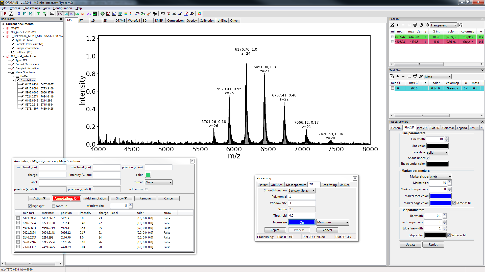

# Home
### About 
ORIGAMI-ANALYSE is a data processing and visualisation software

The analysis software, ORIGAMI-ANALYSE can aid analysis of MS and IM-MS results from multiple instrumental platforms, offering rich data extraction, data processing and visualisation environment. Data can be imported from text (.csv/.txt/.tab), tandem MS (.mgf/.mzML/.mzIdent) and raw files (Waters .raw). ORIGAMI-ANALYSE was developed to handle a large number of files simultaneously, providing comparative and interactive environment to visualise results from multiple resources, generate publication-quality figures and interpret the results in more depth. All the processed data can be also exported as an interactive .html document that can be visualised in a web-browser and shared with your colleagues, reviewers or editors, as well as included as an SI. 

### Main features
-   Import single or multiple files (requires Driftscope for Waters .raw)
-   Batch data extraction, processing and exporting
-   Easy analysis and visualisation of aIM/CIU/SID datasets
-   Highly customisable graphical environment to make high-quality figures
-   Built-in CCS calibration and DT-IMS analysis
-   Added functionality via plugins (e.g. UniDec deconvolution)
-   Export all possible figures in an interactive .html document

### Getting started
See the [installation guide](installation.md) for instructions on how to get started.

### Examples
A number of example files have been provided to get started! Please see various user guides and the [examples page](../user-guide/example-files.md) for more information.

### Main window
