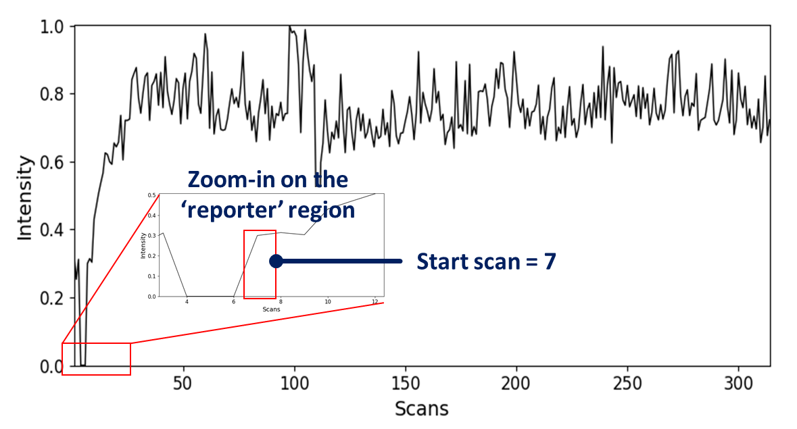
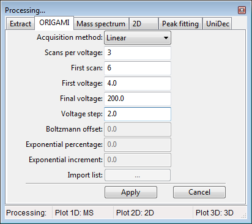
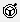
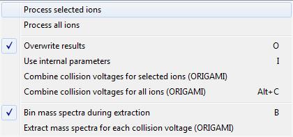
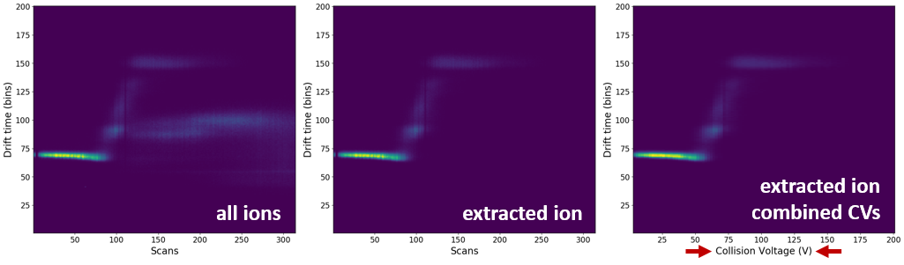
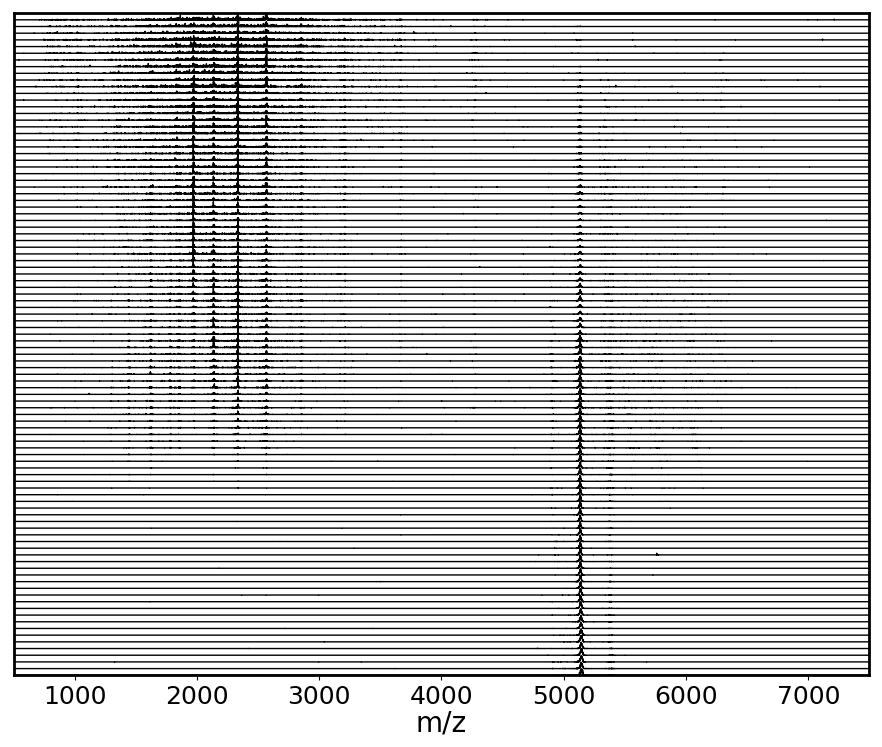
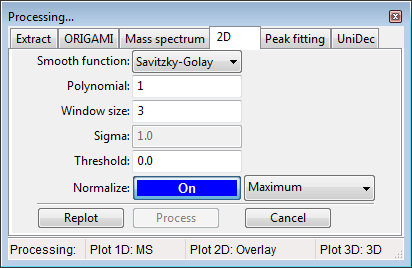
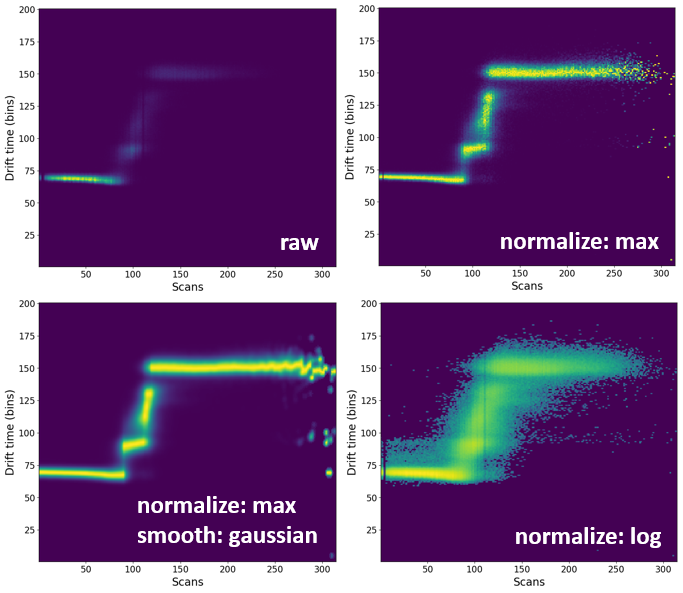

# Analysis of ORIGAMI-MS datasets

In this example we will use file provided with the ORIGAMI distribution. You can download it [here](../example-files/ORIGAMI_ConA_z20.raw.zip) or it should be found in your ORIGAMI directory (**example_data/origami_ms**).

## Data loading

Please have a look at [MS and IM-MS data loading](ms-and-imms-files.md#data-loading).

## Data extraction

Please have a look at [MS and IM-MS data extraction](ms-and-imms-files.md#data-extraction).

## ORIGAMI-MS method

ORIGAMI-MS acquired files are simply CIU datasets that were acquired within a single file in which the collision voltage (or cone voltage) were ramped to increase the activation energy.

There are four methods available which either increase or keep constant the number of scans-per-voltage as the energy increases.

* Linear: the collision voltage (CV) is ramped from **Start Voltage (StartV)** to **End Voltage (EndV)** with **Step Voltage (StepV)** as the increment. The number of scans-per-voltage stays the same and is controlled by **Scans per Voltage (SPV)**.
* Exponential: the CV is ramped from **StartV** to **EndV** with **StepV** as the increment. The SPVs increase as a function of an exponential function where the user specifies the **Exponential %** and **Exponential Increment**. These values determine the rate of the increase.
* Boltzmann: the CV is ramped from **StartV** to **EndV** with **StepV** as the increment. The SPVs increase as a function of an Boltzmann function where the user specifies the **Boltzmann Offset**. These values determine the rate of the increase.
* User-defined: values of **SPV** and **CV** are provided in a list by the user.

The user-defined list looks something like this and is usually provided as a .csv file.

| SPV | CV |
|:---:|:--:|
|  3  |  5 |
|  6  | 10 |
|  9  | 12 |
|  12 | 20 |

## Getting started

The first thing to consider when analysing ORIGAMI-MS based files is the fact that they have a definitive start and end. These two points correspond to the initial and final collision voltage used during the acquisition. ORIGAMI-MS inserts two reporter regions into the acquisition window, and they tend to manifest itself as significant (or sometimes not) dips in the signal intensity. If you started the acquisition correctly, they should be easy to spot. See below for an example

## How to determine first scan

1. Change the view to the RT (chromatogram) tab
2. Zoom-in on the 'reporter' region in the retention time plot. The **first** value after the break is the **start** scan which will be used later on. In this case, the start scan is **7** which means the first CV in the experiment was applied on the 7th scan.

## How to determine ORIGAMI-MS parameters

There are only two ways you can determine what parameters were used in the acquisition.

* You saved them in your labbook or in the header of the MassLynx file (recommended)
* You saved them to a .csv file using the **Save parameters** button in ORIGAMI-MS window during your acquisition

If you have done neither of these things, you can try to figure out your parameters by going to the folder containing ORIGAMI-MS program and looking for the appropriate ORIGAMI_log_**DATE-TIME**.log file which contains **all** commands executed by the program.

## How to combine the same CVs into one

This is a crucial step that will combine multiple scans into one, corresponding to the typical CIU file. First, you must select ions of interest in the MS and subsequently extract the data. Once you've done that, follow these steps.

ORIGAMI-MS panel

1. Open the Processing panel (**SHIFT+2** keyboard shortcut or Menu -> Process -> Settings: ORIGAMI or click on the  button)
2. Fill-in all necessary parameters (depending on your acquisition method). In the example case, we've used: start **scan - 7**, **start voltage - 4**, **final voltage - 200**, **step voltage - 2.0**, **scans-per-voltage - 3**.
3. Go to the Panel: Peaklist and select some or all extracted ions
4. In the toolbar, click on the Process() button and select -> Combine collision voltages for selected/all ions (ORIGAMI)
5. Ions with combined CVs should appear in the Document tree under **Drift time (2D, combined voltages, EIC)**.

The toolbar -> Process menu:

Comparison of the all-ion, extracted-ion and combined voltage EIC heatmaps:

## Extracting mass spectra for each CV

Once you've associated ORIGAMI-MS parameters with the opened file, you can extract mass spectrum for each CV.

1. Provide ORIGAMI-MS parameters (same as above #1)
2. In the toolbar, click on the Process() button and select Extract mass spectra for each collision voltage (ORIGAMI). If the check **Bin mass spectra during extraction** is selected, mass spectra will be automatically linearized based on the parameters set in the **Processing panel: Mass spectrum**. Extraction can take several seconds -> minutes.
3. All MS data will appear in your document under **Mass Spectra**

All extracted mass spectra shown in a waterfall-like plot

## Processing heatmaps

By default, all heatmaps will show the **raw** data which might not always be the most visually pleasing. In some circumstances, it might be necessary to process (e.g. normalize or smooth) the data.

Panel processing: 2D

1. Select any number of ions in the peaklist.
2. In the toolbar, click on the Process() button and select -> Process selected/all ions. Ions will be process based on the parameters in the **Processing panel: 2D**.
3. All process data will appear in the document with the **(processed)** tag attached to the name.

Comparison of processing of *some* processing methods.

