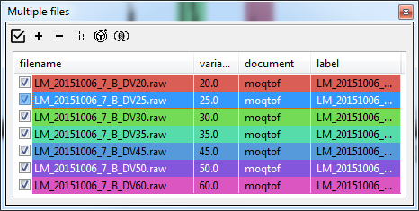
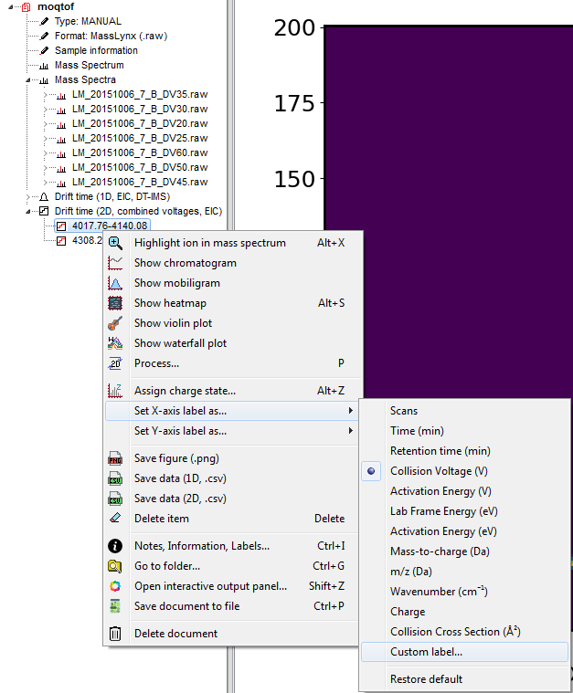
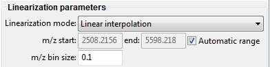
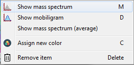

# Analysis of manual CIU/SID/multi-field DTIMS datasets
In this example we will use files provided with the ORIGAMI distribution. You can download them [here](../example-files/dt-ims.zip) or it should be found in your ORIGAMI directory (**example_data/multi-field-dtims**).

### Manual CIU/SID/multi-field DTIMS
Manual CIU/SID/DTIMS datasets consist of multiple files, each differing usually in the energy introduced to the system to either induce fragmentation or unfolding. In our case, we will be using CIU dataset where the collision energy was raised by several volts and we can observe some levels of unfolding.

### Data loading
To load multiple Waters (.raw) files, please use any of the following:
* Use the file menu. File -> Open multiple MassLynx (.raw) files [CIU]
* Use the toolbar. Click on the  button
* Use a keyboard shortcut:
    - **CTRL+SHIFT-R** - open multiple Waters (.raw) files - IM-MS
* Drag-and-drop files in the Multiple files panel

When you have added files to ORIGAMI-ANALYSE, you will be asked to provide document name and document path. If you would like to add more files to the same document, make sure you click on the document in the Document tree and then use any of the above options to load data.

### Manual CIU document
ORIGAMI-ANALYSE utilises **documents** to maintain all raw and processed data. The MANUAL document is a little different, as it requires different type of processing as it is pooling results from multiple files into one. When data is loaded, ORIGAMI-ANALYSE will only load the mass spectra and all-ion mobility data. In addition, a average mass spectrum will be generated from all spectra loaded in. This spectrum will be available under the **Mass Spectrum** tag in the document tree whereas individual spectra will be shown under the **Mass Spectra** sub-tree.

### Data extraction
Although we are dealing with multiple files simulatenously now, data extraction is no different. Please have a look at [MS and IM-MS data extraction](ms-and-imms-files.md#data-extraction). In short, you press-and-hold **CTRL** on your keyboard and drag with your mouse (while holding left-button) in the mass spectrum. An ion is added to the Panel: Peaklist from where you can extract its information. 

### Stitching-up several files together
When data is being extracted for specific ion, ORIGAMI-ANALYSE will use the 'variable' column in the Panel: Multiple files to determine the order in which files should be added. This column can be numerical (e.g. collision voltage, drift voltage) or alphabetical (e.g. name). If no value is provided, its not going to be pretty...

### Getting started
The example provided is a set of files from a linear drift-tube experiment where each file corresponds to different drift voltage. So the variable that will be set in the table is the drift voltage and in this case, is written in the file name.

When you have added these files to ORIGAMI-ANALYSE, you will be asked to specify document name and document path. In this case, yu can simply call it **moqtof**(name of the instrument it was acquired on). There are **6** files with drift voltages of 20, 25, 30, 35, 45, 50 and 60 V. As you will notice, when these files were added, the value of variable is set to 0, as the DV parameter is not saved in the MassLynx (.raw) file. You can specify by double-clicking in the variable column and typing appropriate value. Clicking on any column header will automatically sort the table. 

Panel: Multiple-files

### Combining data from multiple files into one
Once you have added ions to the peaklist, you can extract that [information](ms-and-imms-files.md#data-extraction). 

### Changing x/y-axis labels
By default, the label associated with combined dataset is 'Collision Voltage (V)' as it is expect to be a CIU-like dataset. In our case it is drift voltage, so once the ions have been combined, we can change the label in the Document Tree. 

### Average mass spectrum
The average mass spectrum generated when the data is being added to the document might not have the desired parameters. You can 're-average' the mass spectra by selecting relevant items int the filelist and then clicking on the Process... button and selecting **Average mass spectra (current document)**. ORIGAMI-ANALYSE will use the parameters set in the **Processing panel: Mass Spectrum**.

### Plotting and replotting
The easiest way to plot anything in ORIGAMI-ANALYSE is to do it from the Document Tree and either double-clicking on the desired item or right-clicking and selecting appropriate option. Alternatively, you can right-click on an item in the Panel: Multiple-files and select either **Show mass spectrum** or **Show mobiligram**.

### Customising item
Some parameters, such as *variable* or *label* can be changed by double-clicking in the appropriate field in the table and typing-in a value. Others, such as *color* can only be changed by right-clicking and selecint **Assign new color**. You also do this in batch by selecting several items in the list and clicking on the Annotate... button.
