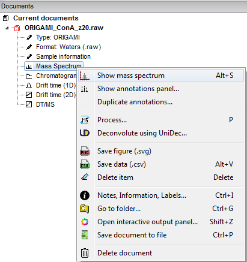
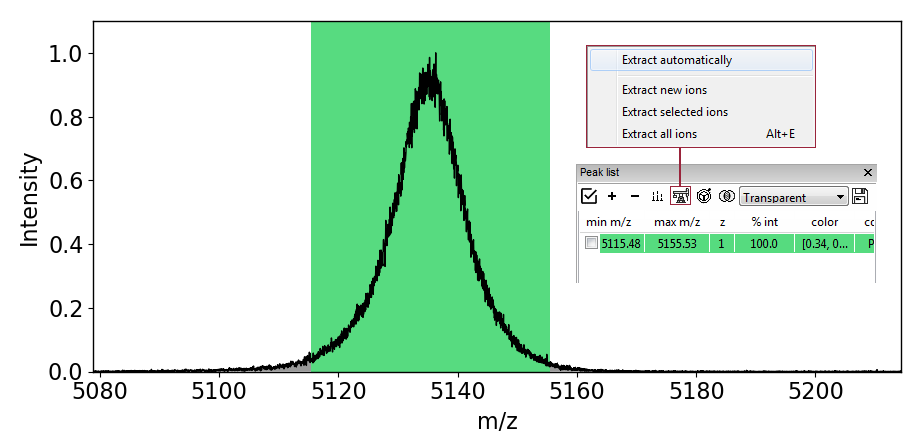
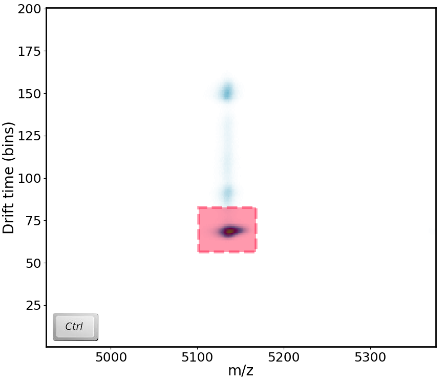
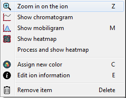
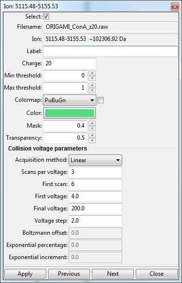
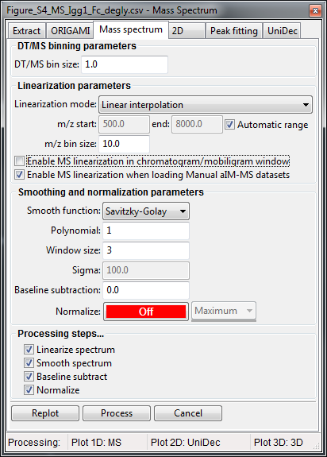

# Analysis of MS and IM-MS files
In this example, we will use a file provided in the example. You can download it from [here](../example-files/ORIGAMI_ConA_z20.raw.zip) or it should be found in your ORIGAMI directory (**example_data/origami_ms**).

### Data loading
To load Waters (.raw) files, please use any of the following:

* Use the file menu. File -> Open ORIGAMI MassLynx (.raw) file [CIU]
* Use the toolbar. Click on the  button
* Use a keyboard shortcut:
    - **CTRL+R** - open Waters (.raw) file - IM-MS   
* Drag-and-drop the file in the main window

### Document tree
Any file you open will result in generation of a **ORIGAMI document** that will contain all **data** that you will generate. It is structured just like a directory on your PC so it should be easy to get used to. When you right-click on any item, a custom menu will appear from which you can figure out what you would like to do. An example is shown below: 

### Plotting and replotting
You can either double-click on an item in the **Document tree** or right-click and select the option "Show...". If you would like to clear a plot, right-click in the plot area and select "Clear plot".

### Data extraction
You can extract various types of data from Waters (.raw) files. The type you extract will depend on the window you are currently viewing. So, if you are in the **MS** window, you can extract **heatmap**, **mobility** and **chromatography** data. If you are in the **RT**, **1D** or **2D** windows, you can extract **mass spectra**. To select region you would like to extract, press and hold **CTRL** on your keyboard and **left-click** drag your mouse on the selected region. Most data will be automatically extracted (except for heatmaps - will discuss shortly). Data that has been extracted will be automatically added to your **document**. 

### Mass spectra (from RT, 1D, 2D windows)
The extracted mass spectra can either represent the **raw** data or **linearized** data, depending on what settings you have enabled. To change this behaviour, open the **Processing window**, go to **Mass spectrum** and check (or uncheck) the "Enable MS linearization in chromatogram/mobiligram window". You can also change linearization settings in this panel. If you are extracting from the RT window, *chromatographic* information will be used, from the 1D window, *drift time* and from 2D window, both will be used. Extracted data will appear under **Mass Spectra**.

#### Video tutorial

<iframe width="560" height="315" src="https://www.youtube.com/embed/OlWHNPCZEgg" frameborder="0" allow="accelerometer; autoplay; encrypted-media; gyroscope; picture-in-picture" allowfullscreen></iframe>

### Heatmaps (from MS window)
When you extract data from the MS window, an ion will automatically be added to the Peaklist. This panel serves as main select-and-compare tool for easy visualisation of multiple items together. In order for the data to be extracted, you must click on the  button and a new menu will appear where appear where you can select the "Extract all ions". If, in future you would like to automatically extract heatmaps, click on the "Extract automatically" toggle. Extracted data will appear under **Drift time (2D, EIC)**.

### Chromatograms (from DT/MS window)
You can extract chromatograms in the DT/MS window where the *m/z* and *drift time* information will be taken into account during data extraction. Extracted data will appear under **Chromatograms (EIC)**.

### Panel: Peaklist
All heatmaps are automatically added to the **Panel peaklist** which usually appears on the right-hand side of the window. From here, you can easily visualise, customise and compare data. 

When you right-click on any item in the list, a menu will appear from which you can easily access various visualisation modes and customisation settings.

When you double-click on an item (or right-click and select "Edit file information") a new window will appear where you can change certain parameters, such as *ORIGAMIMS parameters, charge state, color, colormap, etc*.

### Processing mass spectra
Mass spectra imported using Driftscope are automatically normalized to 1 (not my fault, I promise!). Sometimes, it might be necessary to remove noise or smooth the spectrum so it is more visually appealing. 

Panel processing: MS

1. Right-click on any mass spectrum in the Document tree (e.g. Mass Spectrum) and select **Process...**.
2. A new window will appear where you can adjust processing parameters.
3. Click on the **Replot** button if you first want to see how the data will look or **Process** if you would like to add that data to the document.

### Processing heatmaps
By default, all heatmaps will show the **raw** data which might not always be the most visually pleasing. In some circumstances, it might be necessary to process (e.g. normalize or smooth) the data. 

Panel processing: 2D

Depending what are you planning on processing (e.g. extracted ion heatmap or whole-file heatmap), you can perform processing in the Panel: peaklist or in the Document tree. 

**Panel: peaklist**
1. Select any number of ions in the peaklist.
2. In the toolbar, click on the Process() button and select -> Process selected/all ions. Ions will be process based on the parameters in the **Processing panel: 2D**. 
3. All process data will appear in the document with the **(processed)** tag attached to the name.

**Document tree**
1. Right-click on a desired item in the Document tree (e.g. Drift time (2D)) and select **Process...**
2. A new window will appear where you can adjust processing parameters
3. Click on the **Replot** button if you first want to see how the data will look or **Process** if you would like to add that data to the document.

Comparison of processing of *some* processing methods. 

