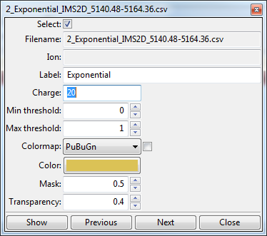
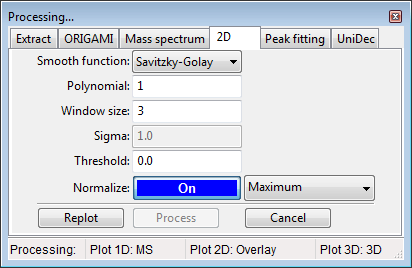

# Analysis of text files

In this example we will use files provided with the ORIGAMI distribution. You can download [MS file](../example-files/MS_p27-FL-K31.csv) and [heatmap file](../example-files/heatmaps.zip) or you can find them in your ORIGAMI directory (**example_data/text**).

## Data loading

To load text files, please use any of the following:

* Use the file menu. File -> Open IM-MS Text file [CIU] or Open MS Text file
* Use the toolbar. Click on the **T** or **T+** button
* Use a keyboard shortcut:
  * **CTRL+T** - open heatmap text (.csv/.txt/.tab) file
* Drag-and-drop the file in the main window
* Clipboard: - MS data only

## Document tree

Any file you open will result in generation of a **ORIGAMI document** that will contain all **data** that you will generate. It is structured just like a directory on your PC so it should be easy to get used to. When you right-click on any item, a custom menu will appear from which you can figure out what you would like to do. An example is shown below:

## Plotting and replotting

You can either double-click on an item in the **Document tree** or right-click and select the option "Show...". If you would like to clear a plot, right-click in the plot area and select "Clear plot".

## Panel: Textlist

All text-based heatmaps are automatically added to the **Panel textlist** which usually appears on the right-hand side of the window. From here, you can easily visualise, customise and compare data.

When you right-click on any item in the list, a menu will appear from which you can easily access various visualisation modes and customisation settings.

When you double-click on an item (or right-click and select "Edit file information") a new window will appear where you can change certain parameters, such as *charge state, color, colormap, etc*.

## Processing heatmaps

By default, all heatmaps will show the **raw** data which might not always be the most visually pleasing. In some circumstances, it might be necessary to process (e.g. normalize or smooth) the data.

### Processing panel: 2D

### Processing from **Panel: Textlist**

1. Select any number of ions in the textlist.
2. In the toolbar, click on the Process() button and select -> Process selected/all ions. Ions will be process based on the parameters in the **Processing panel: 2D**.
3. All process data will appear in the document with the **(processed)** tag attached to the name.

### Processing from **Document tree**

1. Right-click on a desired item in the Document tree (e.g. Drift time (2D)) and select **Process...**
2. A new window will appear where you can adjust processing parameters
3. Click on the **Replot** button if you first want to see how the data will look or **Process** if you would like to add that data to the document.