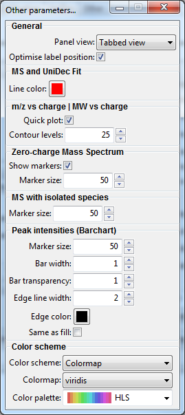
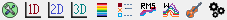
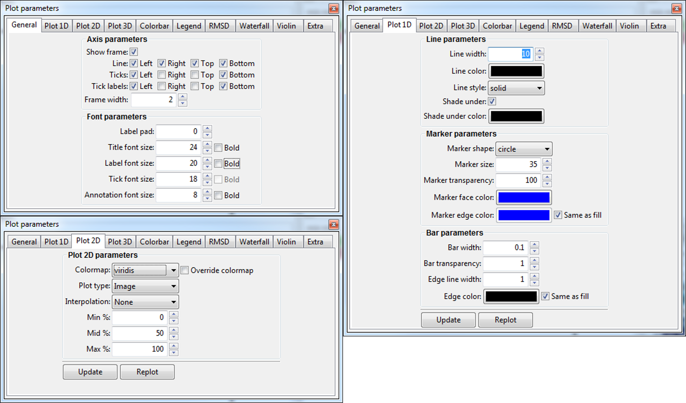

# Customising UniDec plots
In the case of UniDec plots, several parameters such as *color schemes*, *marker size*, *heatmap parameters* and others can be adjusted by opening the **Processing panel: UniDec** and then the **Customisation panel**. 

1. Open the Processing panel: UniDec (**SHIFT+6** on your keyboard or menu -> Process -> UniDec).
2. Click on the Customise plots... button

As you can see, most parameters have been split based on which plot they are applied to. You can simply change the parameter value, close the window and then **replot** the plot you want to improve (settings are not applied automatically). 

Settings such as line widths, line styles, figure size or label size can be adjusted through the Plot Editor panel that is accessible through (Menu -> Plot settings or the toolbar icons )

