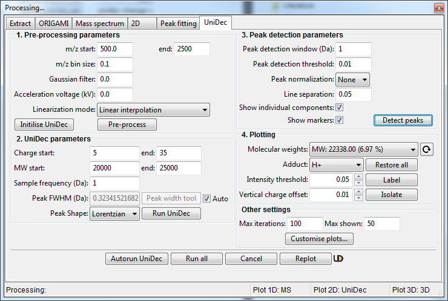
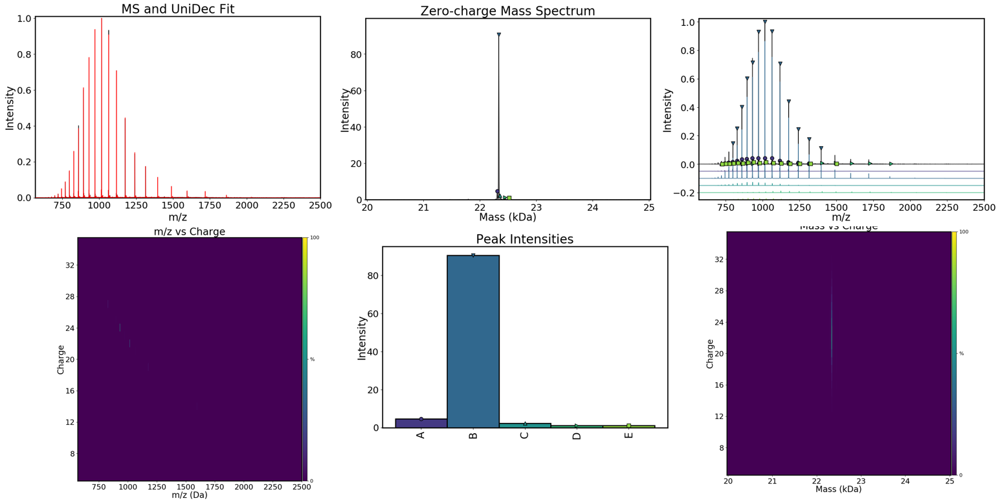
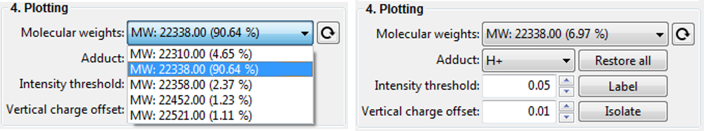
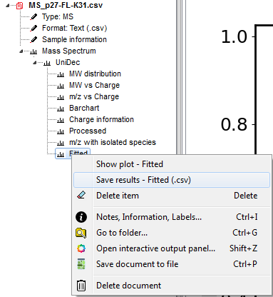

# UniDec deconvolution
UniDec is a Bayesian deconvolution algorithm that can be used to deconvolute mass spectra and ion mobility-mass spectra. It was developed by [Dr. Michael Marty](https://cbc.arizona.edu/faculty/michael-marty) and is freely available under the modified BSD licence. I would highly recommend you check-out [UniDec (and MetaUniDec)](https://github.com/michaelmarty/UniDec/releases) software. 

If you use it in your work, please cite their work:

[M. T. Marty, A. J. Baldwin, E. G. Marklund, G. K. A. Hochberg, J. L. P. Benesch, C. V. Robinson, Anal. Chem. 2015, 87, 4370-4376.](http://pubs.acs.org/doi/abs/10.1021/acs.analchem.5b00140)

### Video tutorial
<iframe width="560" height="315" src="https://www.youtube.com/embed/6_-TDvwH-QQ" frameborder="0" allow="accelerometer; autoplay; encrypted-media; gyroscope; picture-in-picture" allowfullscreen></iframe>

### Deconvolution in ORIGAMI-ANALYSE
Any mass spectrum within a ORIGAMI document can be deconvoluted and therefore a document can contain tens of spectra, each with its own deconvolution results. The easiest way to get started is to find an item in the Document Tree, right-click on it and select **Deconvolute using UniDec...** which will open a new panel where you can adjust the parameters. 

### Example data
In this example we will use a file provided with the ORIGAMI distribution. You can download [MS file](../example-files/MS_p27-FL-K31.csv) or you can find it in your ORIGAMI directory (**example_data/text**). This file contains a mass spectrum of a intrinsically disordered protein, p27 that is approx. 22.5 kDa in size and has a very broad charge state distribution.

### Loading data
Please have a look at [Loading Text files](../data-handling/text-files.md). 
In short, you either drag-and-drop the text file in the main window of ORIGAMI-ANALYSE or go to **File -> Open MS Text file**.

### Deconvolution
Once you've loaded data, right-click on it in the Document Tree and select **Deconvolute using UniDec...** If you are using the example file, you can start with the settings shown below:

1. Specify Pre-processing parameters. You can start with **m/z start = 500** and **m/z end = 2500** with m/z **bin size = 0.1** using **Linear interpolation** method. Click on the **Pre-process** button. If you are using the **Tabbed view**, the results will be shown in the tab **UniDec -> MS**
2. Specify deconvolution parameters. If you are unsure about the sample you are analysing, specify a broad range of charge states and the molecular weight with large-ish Sampling frequency. This will help you narrow down the appropriate range for your sample. Once you are happy, click on the Run UniDec button. If you are using the **Tabbed view**, the results will be shown in **UniDec -> m/z vs Charge / MW vs Charge / MW** tabs.
3. Following successful deconvolution, you can find peaks and identify the *found* molecular weights. To do this, specify appropriate parameters in the **Peak detection parameters** section and then click on the **Detect peaks** button. If you are using the **Tabbed view**, the results will be shown in **UniDec -> Isolated MS / Barplot** tabs.

### Visualisation of results

### Visualisation of individual species
If you are lucky, deconvolution will result in a single species being detect. This is rather unlikely and therefore you will be presented with a range of detected MW. 
In order to select and visualise only **one** species at at time, you can select an item with a molecular weight in the Dropdown menu (see below) and click on the **Isolate** button. You can also label its charge states by clicking on the **Label** button. 

**Note:** It is likely that the automatic label optimiser is enabled and you can change that by clicking on the **Customise plots...** button and unchecking the **Optimise label position** option.

### Saving plots
The easiest way to save any plot in ORIGAMI-ANALYSE is to plot it, customise it and then right-click in the plot area and select **Save figure...**.

**Note:** It is likely that the figure will be automatically resized to a pre-defined image size. This can **very occasionally** cause problems, therefore you disable that option by unchecking the **Resize on saving** menu item.

### Saving data
All deconvolution data is saved within the document and if you to the Document Tree and open-up the item (see below), you can right-click on any item and select the option **Save results**. If you click on the **UniDec** header, you can save all results at the same time.

### Plotting and replotting
Find the desired item in the Document Tree and double-click on it to plot it.