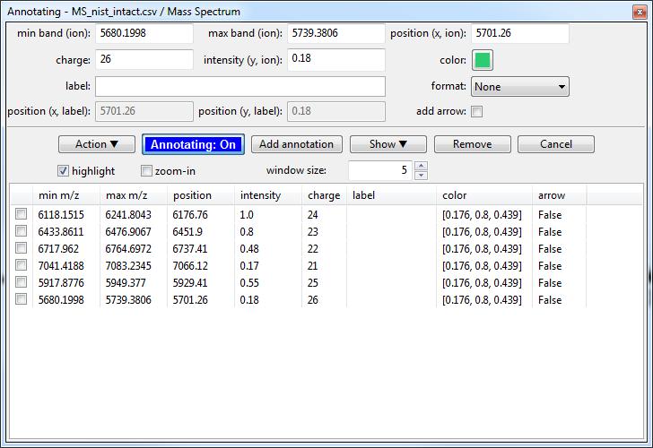
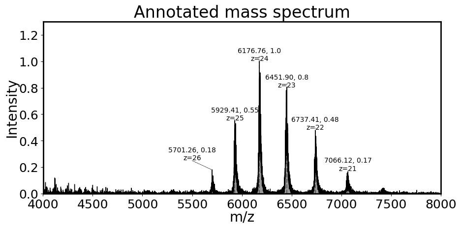
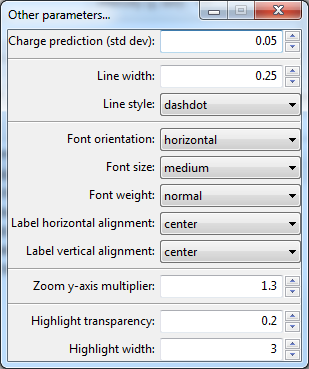
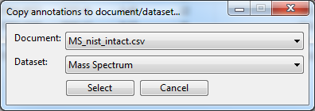

# Annotating mass spectra

Since version 1.1.2 it is possible to annotate mass spectra with custom labels (e.g. *charge state*, *label*) and attached an arrow to highlight low-intensity species.

## Video tutorial on how to annotate mass spectrum

<iframe width="560" height="315" src="https://www.youtube.com/embed/L8zhW2Bppjc" frameborder="0" allow="accelerometer; autoplay; encrypted-media; gyroscope; picture-in-picture" allowfullscreen></iframe>

## Loading data

Please have a look at [Loading Text files](../data-handling/text-files.md).
In short, you either drag-and-drop the text file in the main window of ORIGAMI-ANALYSE or go to **File -> Open MS Text file**.

## Example

In this example we will use a file provided with the ORIGAMI distribution. You can download [MS file](../example-files/MS_nist_intact.csv) or you can find it in your ORIGAMI directory (**example_data/text**).

## Annotating

There is a number of ways you can annote mass spectrum. The *manual* way involves opening an annotation panel and manually selecting peaks. You can also load annotations from a .csv file.

## Opening annotation panel

Find the mass spectrum you would like to annotate in the Document Tree and right-click on it, then select **Show annotations panel**, a new window should show up:

## Adding an annotation

1. Click on the **Annotating: Off** button so it switches to **Annotating: On**.
2. Move your mouse to the mass spectrum window and hold **CTRL** on your keyboard while also dragging mouse over a peak (like during data extraction).
3. When you release the mouse, a number of values will be added in the annotation panel (min/max band, position x, charge, intensity, etc) - all of which can be changed. When you are happy click on the **Add annotation** button.
4. The annotation should appear in a list below. Repeat till you are fnished.

## Editing an annotation

1. Select a annotation in the list below.
2. Change any value.
3. Click on the **Add annotation** button.

## Adding arrow to annotation

1. Select a annotation in the list below.
2. Uncheck the **add arrow** checkbox.
3. Adjust values of *position (x, label)* and *position (y, label)*
4. Click on the **Add annotation** button.

## Showing all annotations

1. Click on the **Show** button and select appropriate option (e.g. Show m/z, intensity, charge).
2. All annotations should be shown on the mass spectrum.

## Customising annotations

You can adjust several parameters (*annotation color, arrow line thickness, label size, etc*) in the **Customise annotations** panel. You can open it by clicking on the **Action** button and selecting **Customise other settings...**. A new panel should open.

**Note:** You will have to replot annotations as these settings do not automatically update.

## Duplicating annotations

Sometimes you might have more than one mass spectrum a document that has a lot of the same peaks. You could manually re-add these, but there is a quicker way.

1. Find the mass spectrum with annotations and right-click on it. Select **Duplicate annotations...** option.
2. A new window will appear where you can select another document and mass spectrum to which annotations should be copied.
3. Once you have selected, click **Select** and see if they have been copied.
4. One thing to remember is that the intensity of the peaks in different peaks will vary so you have to **fix** the intensity of annotation label. To do this, open the annotation panel for newly copied annotations (Document Tree -> Show annotations panel...) and click on the **Action** button. Once there, select **Fix intensity** option.

## Video tutorial on how to duplicate annotations

<iframe width="560" height="315" src="https://www.youtube.com/embed/YGy2nXnIQ64" frameborder="0" allow="accelerometer; autoplay; encrypted-media; gyroscope; picture-in-picture" allowfullscreen></iframe>
