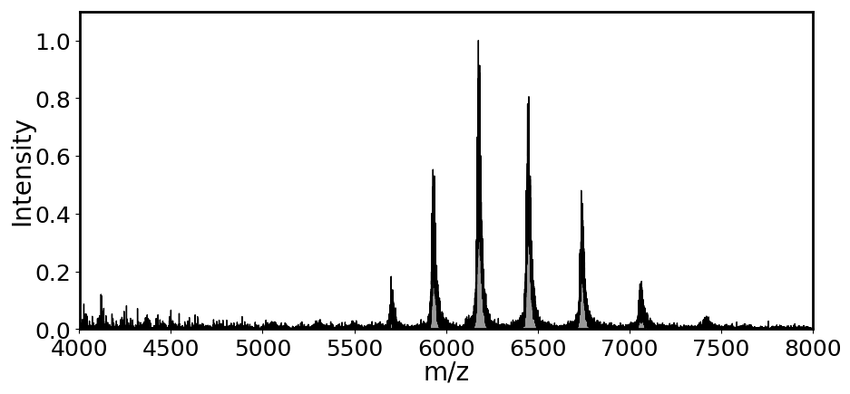
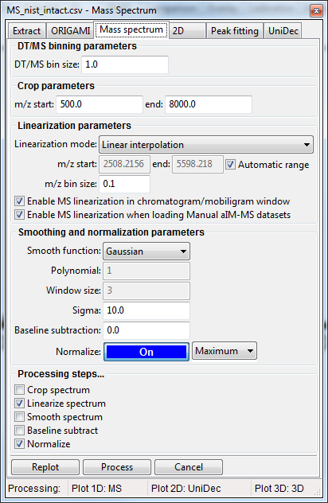
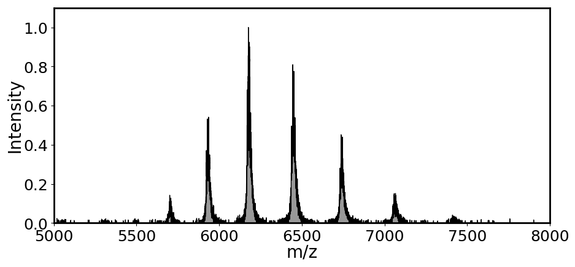

# Processing mass spectra
All mass spectra found in a ORIGAMI document can be processed in a way that reduced noise, smoothes peaks, or linearized the spectrum to reduce its size. 

### Video tutorial

<iframe width="560" height="315" src="https://www.youtube.com/embed/cDUFutzksbY" frameborder="0" allow="accelerometer; autoplay; encrypted-media; gyroscope; picture-in-picture" allowfullscreen></iframe>

### Loading data
Please have a look at [Loading Text files](../data-handling/text-files.md). 
In short, you either drag-and-drop the text file in the main window of ORIGAMI-ANALYSE or go to **File -> Open MS Text file**.

### Example
In this example we will use a file provided with the ORIGAMI distribution. You can download [MS file](../example-files/MS_nist_intact.csv) or you can find it in your ORIGAMI directory (**example_data/text**). 

**Raw mass spectrum**

### Opening processing panel
The easiest way to process a mass spectrum is to find it in the Document Tree, right-click on it and select the **Process...** option. This will open a new window where you can select desired parameters and also execute the action. If you simply open the Processing window, it is not guaranteed ORIGAMI will know which mass spectrum you want to process. Of course, this is only a concern if you have more than one spectrum in the document.

### Processing
Spectral processing is taken in steps, and you can specify which action you would like to take. 

* **Crop spectrum:** specify the min m/z and max m/z range spectrum should restricted to
* **Linearize spectrum:** linearize spectrum to have consistent spacing between points. There is a number of methods available that will change the way the spacing is calculated
* **Smooth spectrum:** specify the smoothing method (Gaussian or Savitzky-Golay)
* **Baseline subtract:** remove noise from the spectrum
* **Normalize:** normalize the spectrum to maximum value of 1

Once you are happy with your parameters, you can either **replot** the spectrum (data **will not** be added to the document) or **process** (data **will** be added to the document). 

**Processed mass spectrum**

**Note:** If the **Process** button is disable, it probably means you just opened the Processing panel without specifying the mass spectrum - you can close it and try again from the Document Tree view.
